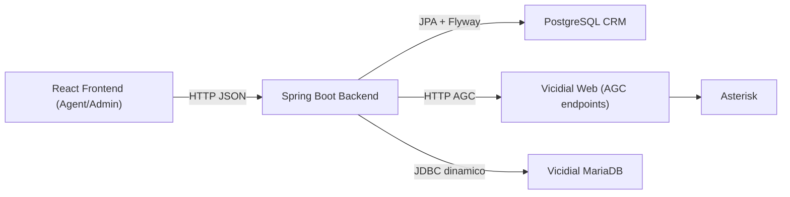
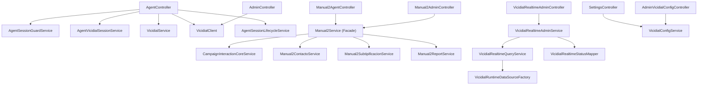
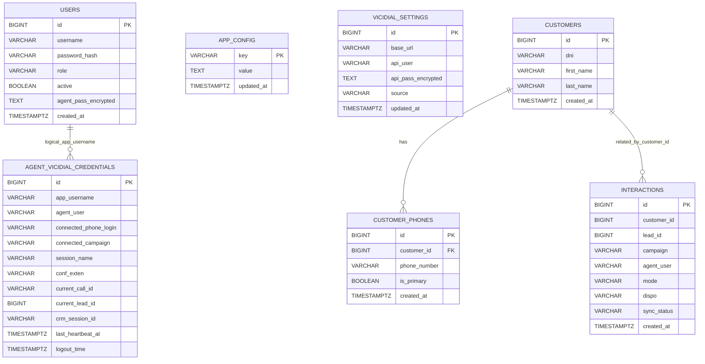
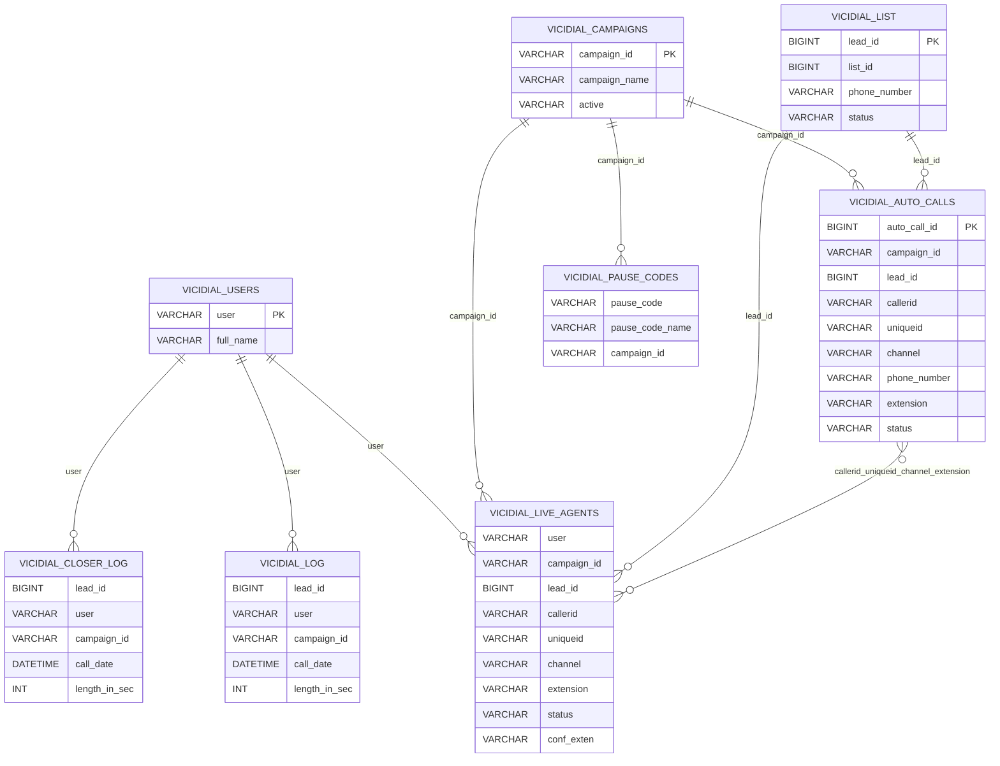
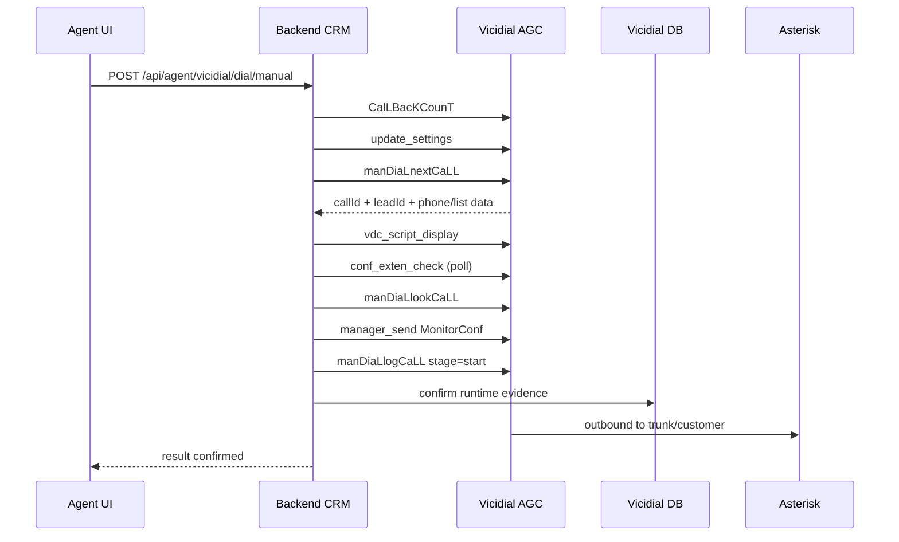
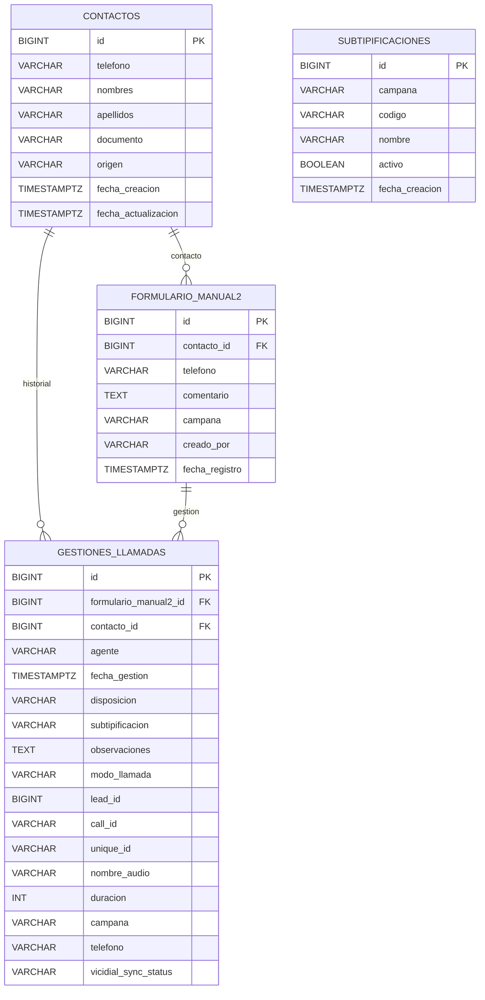

# TELCO3 CRM + Vicidial Integration

Proyecto CRM (Spring Boot + React) integrado con Vicidial/Asterisk para operacion de agentes, marcacion manual/next dial, gestion de interacciones y monitoreo admin realtime.

## 1. Alcance de esta fase (refactor seguro)

Esta fase aplica refactor incremental sin romper funcionalidad existente, con foco en:

- Validar uso real de endpoints frontend -> backend.
- Consolidar configuracion principal en `application.properties`.
- Mantener compatibilidad de endpoints legacy aun usados.
- Alinear variables frontend de base URL.
- Documentar arquitectura, base de datos y flujos.

No se altera la logica funcional ya estable de:

- `POST /api/agent/vicidial/dial/manual`
- `POST /api/agent/vicidial/dial/next`
- `GET /api/agent/active-lead`
- `GET /api/agent/context`
- Flujo AGC/Vicidial operativo.

Fase B (consolidacion interna) agrega:

- Separacion interna de responsabilidades en Manual2 sin cambiar endpoints.
- Delegacion de guardas de sesion en `AgentSessionGuardService`.
- Base hibrida para futuras campanas via `CampaignInteractionCoreService`.
- Marcado explicito de dominio legacy (english naming) para evitar mezcla en nuevos desarrollos.

## 2. Arquitectura general



## 3. Arquitectura backend



## 4. Modulos

Backend:

- `auth`: login JWT.
- `agent`: profile, session, dial flow, active lead/context, interactions.
- `admin`: dashboard legacy y gestion usuarios/settings.
- `admin/vicidial`: realtime admin y base de import leads.
- `settings`: settings de Vicidial por API legacy.
- `vicidial`: cliente AGC, parser, runtime SQL, session lifecycle.
- `report`: resumen/export CSV.
- `importer`: import CSV legacy.
- `domain`: entidades JPA/repositorios.
- `campaign/core`: servicios comunes de interaccion/gestion reutilizables por campana.
- `manual2`: adaptador de campana actual (controllers) + servicios internos especializados.

Frontend:

- `LoginPage`
- `AgentPage`
- `AdminPage` (legacy)
- `AdminRealtimePage` (nuevo)

## 5. Matriz real frontend -> endpoint

### 5.1 Rutas consumidas por archivo frontend

| Frontend file | Funcion/uso | Endpoint backend |
|---|---|---|
| `frontend/src/pages/LoginPage.tsx` | `login` | `POST /api/auth/login` |
| `frontend/src/pages/AgentPage.tsx` | `getAgentProfile` | `GET /api/agent/profile` |
| `frontend/src/pages/AgentPage.tsx` | `updateAgentProfilePass` | `PUT /api/agent/profile/agent-pass` |
| `frontend/src/pages/AgentPage.tsx` | `connectVicidialPhone` | `POST /api/agent/vicidial/phone/connect` |
| `frontend/src/pages/AgentPage.tsx` | `disconnectVicidialPhone` | `POST /api/agent/vicidial/phone/disconnect` |
| `frontend/src/pages/AgentPage.tsx` | `getVicidialCampaigns` | `GET /api/agent/vicidial/campaigns` |
| `frontend/src/pages/AgentPage.tsx` | `connectVicidialCampaign` | `POST /api/agent/vicidial/campaign/connect` |
| `frontend/src/pages/AgentPage.tsx` | `getVicidialStatus` | `GET /api/agent/vicidial/status` |
| `frontend/src/pages/AgentPage.tsx` | `getCampaignDetails` | `GET /api/campaigns/{campaignId}` |
| `frontend/src/pages/AgentPage.tsx` | `agentLogout` | `POST /api/agent/logout` |
| `frontend/src/pages/AgentPage.tsx` | `getActiveLead` | `GET /api/agent/active-lead` |
| `frontend/src/pages/AgentPage.tsx` | `getContext` | `GET /api/agent/context` |
| `frontend/src/pages/AgentPage.tsx` | `dialNext` | `POST /api/agent/vicidial/dial/next` |
| `frontend/src/pages/AgentPage.tsx` | `manualDial` | `POST /api/agent/vicidial/dial/manual` |
| `frontend/src/pages/AgentPage.tsx` | `hangupCall` | `POST /api/agent/vicidial/call/hangup` |
| `frontend/src/pages/AgentPage.tsx` | `saveInteraction` | `POST /api/agent/interactions` |
| `frontend/src/pages/AgentPage.tsx` | `retryInteraction` | `POST /api/agent/interactions/{id}/retry-vicidial` |
| `frontend/src/pages/AgentPage.tsx` | `previewAction` | `POST /api/agent/preview-action` |
| `frontend/src/pages/AgentPage.tsx` | `pauseAction` | `POST /api/agent/pause` |
| `frontend/src/pages/AdminPage.tsx` | `adminSummary` | `GET /api/admin/summary` |
| `frontend/src/pages/AdminPage.tsx` | `adminAgents` | `GET /api/admin/agents` |
| `frontend/src/pages/AdminPage.tsx` | `adminCampaigns` | `GET /api/admin/campaigns` |
| `frontend/src/pages/AdminPage.tsx` | `adminInteractions` | `GET /api/admin/interactions` |
| `frontend/src/pages/AdminPage.tsx` | `adminExportCsvUrl` | `GET /api/admin/interactions/export.csv` |
| `frontend/src/pages/AdminPage.tsx` | `adminUsers` | `GET /api/admin/users` |
| `frontend/src/pages/AdminPage.tsx` | `adminCreateUser` | `POST /api/admin/users` |
| `frontend/src/pages/AdminPage.tsx` | `adminSettings` | `GET /api/admin/settings` |
| `frontend/src/pages/AdminPage.tsx` | `adminUpdateSettings` | `PUT /api/admin/settings` |
| `frontend/src/pages/AdminPage.tsx` | `adminUpdateAgentPass` | `PUT /api/admin/users/{id}/agent-pass` |
| `frontend/src/pages/AdminRealtimePage.tsx` | `adminVicidialRealtimeSummary` | `GET /api/admin/vicidial/realtime/summary` |
| `frontend/src/pages/AdminRealtimePage.tsx` | `adminVicidialRealtimeAgents` | `GET /api/admin/vicidial/realtime/agents` |
| `frontend/src/pages/AdminRealtimePage.tsx` | `adminVicidialRealtimePauseCodes` | `GET /api/admin/vicidial/realtime/pause-codes` |
| `frontend/src/pages/AdminRealtimePage.tsx` | `adminVicidialRealtimeCampaigns` | `GET /api/admin/vicidial/realtime/campaigns` |

### 5.2 Endpoints duplicados/alias y decision de compatibilidad

- Configuracion Vicidial:
  - `GET/PUT /api/settings/vicidial`
  - `GET/PUT /api/admin/settings`
  - `GET/PUT /api/admin/config/vicidial`
  - Estado:
    - Oficial: `GET/PUT /api/admin/settings`
    - Compatibilidad: `GET/PUT /api/settings/vicidial`
    - Deprecated (alias): `GET/PUT /api/admin/config/vicidial`

- Dial next alias:
  - Principal: `POST /api/agent/vicidial/dial/next`
  - Compatibilidad deprecated: `POST /api/agent/vicidial/manual/next`
  - Estado: se mantiene alias para no romper clientes antiguos.

## 6. Configuracion consolidada

### 6.1 Fuente principal

- Archivo principal: `backend/src/main/resources/application.properties`.
- `application.yml` se mantiene minimo para compatibilidad de tooling y evitar duplicidad efectiva de claves.

### 6.2 Reglas de DB y migraciones

- Flyway habilitado: `spring.flyway.enabled=true`.
- Hibernate solo valida: `spring.jpa.hibernate.ddl-auto=validate`.
- Migraciones oficiales en `backend/src/main/resources/db/migration`.

### 6.3 Compatibilidad de variables de entorno

Datasource password con fallback compatible:

- `SPRING_DATASOURCE_PASSWORD`
- `POSTGRES_PASSWORD`
- `POSTGRES_PASS` (legacy docker)

## 7. Frontend env alignment

Se soportan ambas variables sin romper despliegues existentes:

- `VITE_BACKEND_BASE_URL` (preferida)
- `VITE_API_BASE_URL` (compatibilidad)

Resolucion aplicada:

1. `VITE_BACKEND_BASE_URL`
2. `VITE_API_BASE_URL`
3. fallback `http://localhost:8080`

### 7.1 Limpieza de bajo riesgo aplicada

Se eliminaron duplicados legacy `*.js` dentro de `frontend/src` y se mantiene solo fuente `*.ts/*.tsx` como contrato oficial de frontend.

- Entry point oficial: `frontend/src/main.tsx`
- Se retiraron copias legacy de:
  - `api/client.js`, `api/sdk.js`
  - `app/App.js`
  - `components/ui/AuthStepper.js`, `components/ui/ViciCard.js`
  - `pages/AdminPage.js`, `pages/AdminRealtimePage.js`, `pages/AgentPage.js`, `pages/LoginPage.js`
  - `main.js`
  - `types/openapi.js`

## 8. Arquitectura de base de datos (CRM propio)



Notas:

- `VICIDIAL_SETTINGS` queda como legacy historico; configuracion activa se almacena en `APP_CONFIG`.
- `AGENT_VICIDIAL_CREDENTIALS` funciona como estado operativo/sesion agente CRM<->Vicidial.
- Dominio legacy (mantenido por compatibilidad): `interactions`, `customers`, `customer_phones`.
- Dominio objetivo para nuevas campanas: `interacciones`, `contactos`, `formulario_manual2`, `gestiones_llamadas`, `subtipificaciones`.

## 9. Tablas Vicidial usadas (referencial logico)



## 10. Flujo principal de llamada (resumen)



## 11. Endpoint catalog por modulo

Auth:

- `POST /api/auth/login`

Agent:

- `GET /api/agent/profile`
- `PUT /api/agent/profile/agent-pass`
- `POST /api/agent/vicidial/phone/connect`
- `POST /api/agent/vicidial/phone/disconnect`
- `GET /api/agent/vicidial/campaigns`
- `POST /api/agent/vicidial/campaign/connect`
- `GET /api/agent/vicidial/status`
- `POST /api/agent/vicidial/poll` (deprecated)
- `GET /api/agent/active-lead`
- `GET /api/agent/context`
- `POST /api/agent/vicidial/dial/next`
- `POST /api/agent/vicidial/manual/next` (compat alias, deprecated)
- `POST /api/agent/vicidial/dial/manual`
- `POST /api/agent/vicidial/call/hangup`
- `POST /api/agent/interactions`
- `POST /api/agent/interactions/{id}/retry-vicidial`
- `POST /api/agent/preview-action`
- `POST /api/agent/pause`
- `POST /api/agent/logout`
- `GET /api/agent/manual2/disposiciones`
- `GET /api/agent/manual2/subtipificaciones`
- `GET /api/agent/manual2/contacto`
- `POST /api/agent/manual2/formulario` (deprecated)
- `POST /api/agent/manual2/gestion`
- `GET /api/agent/manual2/historial` (deprecated)

Admin legacy:

- `GET /api/admin/summary`
- `GET /api/admin/agents`
- `GET /api/admin/campaigns`
- `GET /api/admin/interactions`
- `GET /api/admin/interactions/export.csv`
- `GET /api/admin/users`
- `POST /api/admin/users`
- `PUT /api/admin/users/{id}` (deprecated)
- `PUT /api/admin/users/{id}/agent-pass`
- `GET /api/admin/settings`
- `PUT /api/admin/settings`
- `GET /api/admin/manual2/reporte`
- `GET /api/admin/manual2/reporte.csv`
- `GET /api/admin/manual2/historial` (deprecated)

Admin realtime Vicidial:

- `GET /api/admin/vicidial/realtime/summary`
- `GET /api/admin/vicidial/realtime/agents`
- `GET /api/admin/vicidial/realtime/pause-codes`
- `GET /api/admin/vicidial/realtime/campaigns`
- `POST /api/admin/vicidial/leads/import` (base de diseno, retorna 501 por ahora)

Settings:

- Oficial:
  - `GET /api/admin/settings`
  - `PUT /api/admin/settings`
- Compatibilidad:
  - `GET /api/settings/vicidial`
  - `PUT /api/settings/vicidial`
- Deprecated:
  - `GET /api/admin/config/vicidial`
  - `PUT /api/admin/config/vicidial`

Otros:

- `GET /api/reports/summary` (deprecated)
- `GET /api/reports/export` (deprecated)
- `POST /api/vicidial/leads/import` (deprecated)
- `GET /api/campaigns/{campaignId}`
- `GET /api/dev/vicidial/diag` (solo diagnostico)

## 12. Levantar entorno

Backend:

```bash
cd backend
mvn spring-boot:run
```

Frontend:

```bash
cd frontend
npm install
npm run dev
```

Docker (postgres + backend):

```bash
cd docker
docker compose up --build
```

## 13. Configuracion requerida (resumen)

Backend:

- `POSTGRES_HOST`
- `POSTGRES_PORT`
- `POSTGRES_DB`
- `POSTGRES_USER`
- `POSTGRES_PASSWORD` o `POSTGRES_PASS`
- `JWT_SECRET`
- `APP_CRYPTO_KEY`

Vicidial (HTTP):

- `VICIDIAL_BASE_URL`
- `VICIDIAL_API_USER`
- `VICIDIAL_API_PASS`
- `VICIDIAL_SOURCE`

Frontend:

- `VITE_BACKEND_BASE_URL` (preferida)
- `VITE_API_BASE_URL` (compat)

## 14. Flyway y schema

Decisiones operativas:

- Flyway es la fuente oficial de cambios de schema.
- Hibernate no crea tablas ni altera schema; solo valida.
- No eliminar `db/migration` ni ejecutar limpieza manual de historial.

## 15. Compatibilidad y limpieza incremental

Se conserva:

- Endpoints legacy consumidos por frontend actual.
- Alias de dial next por compatibilidad.
- Superficie admin legacy mientras coexiste con admin realtime.

Limpieza futura segura recomendada:

1. Definir fecha de retiro de aliases `/api/settings/vicidial` y `/api/admin/config/vicidial` cuando no haya consumidores externos.
2. Migrar AdminPage legacy a realtime y retirar endpoints legacy cuando no haya consumo.
3. Retirar modelo `vicidial_settings` solo tras validacion de cero uso real.
4. Alinear OpenAPI con todos los endpoints activos y marcadores de compatibilidad.

## 16. Formulario Manual2, gestiones e historial

### 16.1 Diseno funcional

- Formulario por campana inicial: `Manual2`.
- El telefono de llamada (next dial / manual dial) se usa para buscar contacto en BD propia.
- Si existe contacto: se precargan datos para editar/completar.
- Si no existe: se crea contacto/referido al guardar.
- Disposicion operativa se obtiene desde Vicidial:
  - primero `vicidial_campaign_statuses` por campana
  - fallback `vicidial_statuses`
- Guardado final de gestion:
  - solo cuando la llamada ya no esta activa (`INCALL` / `DIALING` bloquea guardado)
  - persiste historial en BD del sistema
  - sincroniza disposicion en Vicidial (`external_status`) cuando hay `lead_id`
- Reporte admin consulta solo BD del sistema (`gestiones_llamadas`, `formulario_manual2`, `contactos`).

### 16.2 Tablas nuevas (espanol)

- `contactos`
- `formulario_manual2`
- `gestiones_llamadas`
- `subtipificaciones`

Migracion: `backend/src/main/resources/db/migration/V10__manual2_formularios_y_gestiones.sql`

### 16.3 Modelo de datos Manual2



### 16.4 Origen de `nombre_audio`

- Durante flujo de llamada/hangup, backend construye `recordingFilename` con:
  - `yyyyMMdd-HHmmss_<telefono>` cuando hay telefono
  - fallback `unique_id`
  - fallback `call_id`
- Ese valor se expone en `hangup.details.recordingFilename` y se persiste como `gestiones_llamadas.nombre_audio`.

### 16.5 Reporte admin Manual2

Filtros soportados:

- fecha `from` / `to`
- `campana`
- `agente`
- `disposicion`
- `telefono`
- `cliente` (busqueda por nombre/apellido)

Salida incluye:

- fecha/hora, agente, campana, telefono, cliente, disposicion, subtipificacion, comentario, observaciones
- `lead_id`, `call_id`, `unique_id`, `nombre_audio`, `modo_llamada`, `duracion`

## 17. Consolidacion interna Fase B

Cambios estructurales aplicados sin romper contratos publicos:

- `Manual2Service` ahora funciona como facade/orquestador y delega:
  - `Manual2ContactoService`
  - `Manual2SubtipificacionService`
  - `Manual2ReportService`
  - `CampaignInteractionCoreService` (logica comun reutilizable)
- `AgentController` delega validaciones de sesion/autenticacion a `AgentSessionGuardService`.
- Se marcaron repositorios/entidades legacy con `@Deprecated` para evitar que nuevos desarrollos mezclen ambos dominios.

Base hibrida para campanas futuras:

- Core comun: servicios en `campaign/core` para interaccion/contacto/validaciones.
- Adaptador de campana: `manual2` mantiene endpoints actuales y reglas particulares.
- Siguiente campana recomendada (ej. `UpgradeMovil`) debe implementar adaptador sobre el mismo core, sin duplicar flujo completo.
